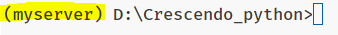

# Crescendo_python

Crescendo Project Python

## 작동시키키 위해 필요한 것들

1. python 3.10.xx 버전
2. 가상환경 작동전 설치할것

```
pip install django
pip install djangorestframework
pip install django-cors-headers
```

3. 가상환경 작동하기
   `myserver\Scripts\activate`
   
   이런식으로 보이면 가상환경 로딩성공
   ) 가상환경 작동이 안되면 관리자 powershell에 `Set-ExecutionPolicy -ExecutionPolicy RemoteSigned` 실행
   

5. 가상환경 작동후 설치할것

```

pip install pytube
pip install music21
pip install basic_pitch
pip install pydub

```

5. ffempeg 설치
   cmd켜고
   `choco(or winget, scoop) install ffmpeg `

chocolatey 설치 방법
`Set-ExecutionPolicy Bypass -Scope Process -Force; [System.Net.ServicePointManager]::SecurityProtocol = [System.Net.ServicePointManager]::SecurityProtocol -bor 3072; iex ((New-Object System.Net.WebClient).DownloadString('https://community.chocolatey.org/install.ps1'))`
커맨드에 입력후 나오는 질문에 y입력

++. base.py 에 전역변수 설정-> 실행환경에 맞게 바꾸기

- todo
  저장소 링크 따로 저장하는 파이썬 파일 만들기
  스프링포트로 내보낼수 있게 하기
  ai api 구축하기-> api로 음악생성하면 만들어뒀던 notation돌려서 musicxml파일 만들기

## 요청신호 보내는 법
http://127.0.0.1:8181/youtube/youtube
post 방식으로 url 보내기

6. youtube 다운안될때
   pytube 충돌 문제 일수 있음
   pip uninstall pytube
   pip uninstall pytube3 실행후
   pip install pytube 다시 깔기
